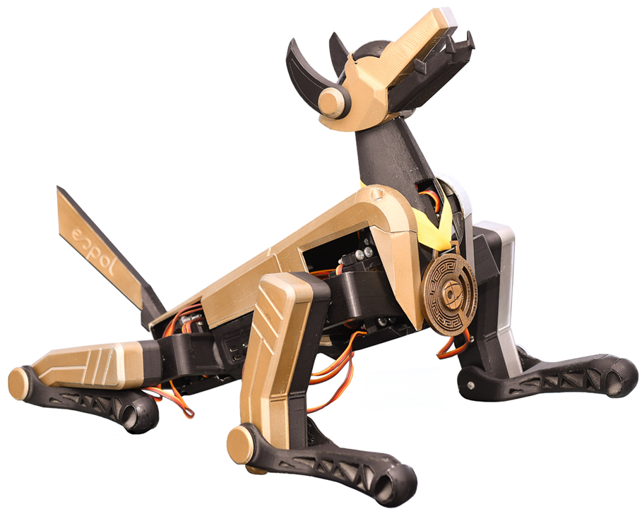

# K9-Buddy
K9-Buddy es un robot cuadrúpedo de código abierto diseñado para fomentar la educación en STEAM y proporcionar una base sólida para competir en eventos de robótica. Destacándose por su bajo costo, K9-Buddy es accesible tanto para estudiantes como para entusiastas de la robótica. 

  

### Configuración del entorno
1. Actualizar el Sistema
Abre una terminal y ejecuta los siguientes comandos para actualizar la lista de paquetes y actualizar los paquetes instalados a sus versiones más recientes:

'''sudo apt-get update'''

sudo apt-get upgrade
